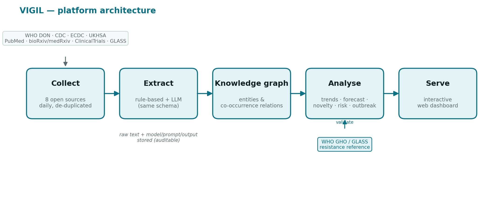
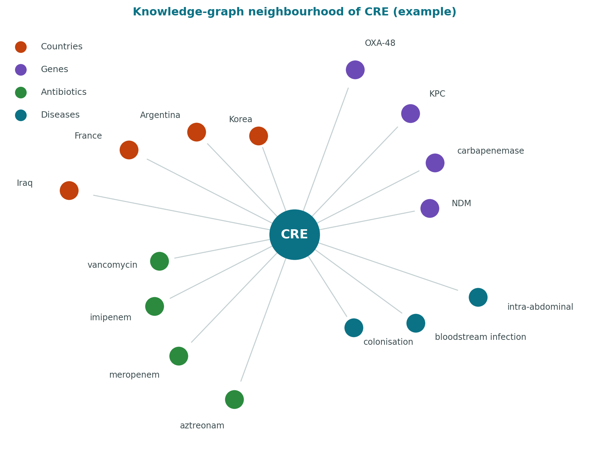

# VIGIL: an open, automatically-updating platform for global antimicrobial-resistance and infectious-disease intelligence from open-source text

> **DRAFT preprint (resource descriptor).** Before posting: (1) regenerate the
> numbers below from the live platform (they update daily); (2) complete the
> citations marked `[ref]`. Numbers here are from a snapshot of **2,075
> documents**.

**Author.** Yen-Hsiang Wang, MD, MSc¹ · rogerwang890928@gmail.com ·
ORCID: [0000-0003-0307-8447](https://orcid.org/0000-0003-0307-8447)
¹ Graduate Institute of Medical Sciences, College of Medicine, Taipei Medical
University, Taipei 11031, Taiwan.

**Availability.** Code: https://github.com/Rogerking928/id-intel-platform ·
Archive/DOI: https://doi.org/10.5281/zenodo.21263882 ·
Live demo: https://id-intel-platform-4gkpazd4mhtj2upak5pzm9.streamlit.app/ ·
Licence: MIT.

---

## Abstract

**Background.** Antimicrobial resistance (AMR) and emerging infections generate
large volumes of open-source text — outbreak alerts, peer-reviewed and preprint
literature, trial registries, and surveillance reports — yet converting this
text into structured, comparable intelligence remains largely manual. Existing
open-source epidemic-intelligence systems are optimised for outbreak event
detection rather than AMR-specific structured extraction, and few are fully open,
reproducible, or explicitly benchmarked against reference surveillance data.

**Objective.** To design, build, and openly release a reproducible platform that
automatically collects open-source infectious-disease/AMR text, extracts a
structured schema, builds a knowledge graph, and produces validation-first
analytics, with an Asia-Pacific (APAC) focus.

**Implementation.** VIGIL collects documents daily from eight configured source
families (WHO Disease Outbreak News, US CDC, ECDC, UK Health Security Agency,
PubMed, bioRxiv/medRxiv via Europe PMC, ClinicalTrials.gov, and WHO GLASS/GHO).
Each document is processed by an always-on rule-based extractor and an optional
large language model (LLM), both returning the same schema (pathogen, resistance
gene/mechanism, antibiotic, disease, country, event type). Entity co-occurrence
yields a knowledge graph; downstream modules compute growth-rate and
emerging-signal detection, weekly-volume forecasting with backtesting, novelty
detection, graph queries, a global heatmap, a country risk signal, and an
outbreak module. Analytics are validated against WHO GHO/GLASS resistance
indicators, which the platform ingests automatically. The stack (Python, SQLite,
Streamlit) is free, reproducible, and updates daily via continuous integration.

**Results.** A snapshot of 2,075 documents across seven actively-contributing
sources produced 31 distinct pathogens, 12 resistance genes/mechanisms, 62
countries, and 1,060 knowledge-graph relations, alongside 1,005 WHO GHO reference
resistance values (101 countries, 2016–2023). In a preliminary construct-validity
analysis of 23 countries, raw document volume was essentially uncorrelated with
measured MRSA bloodstream-infection resistance (Spearman ρ = 0.06), whereas a
publication-normalised AMR share showed a weak positive association (ρ = 0.28).
Literature signal did not discriminate which of 39 countries had officially
reported outbreaks (rank-AUC = 0.16); reported outbreaks concentrated in
low-literature, lower-resource settings — a quantification of the global
surveillance gap.

**Conclusions.** VIGIL is an open, reproducible, validation-first infrastructure
for AMR and infectious-disease intelligence, and a foundation for downstream
methodological research including clinician-annotated LLM extraction benchmarking
and early-warning modelling. It is openly available with a citable DOI.

**Keywords.** antimicrobial resistance; infectious disease surveillance; large
language models; information extraction; knowledge graph; open data; Asia-Pacific.

---

## 1. Background

Antimicrobial resistance is among the leading global health threats, associated
with millions of attributable and associated deaths annually, with the heaviest
burden in low- and middle-income regions where surveillance capacity is weakest
`[ref: GBD AMR 2022; WHO AMR]`. Timely awareness of where resistant pathogens and
outbreaks are emerging depends on synthesising information that is scattered
across many open sources — national and supranational alerts, the biomedical
literature and preprints, and clinical-trial registries — updated continuously
and in heterogeneous formats.

Open-source epidemic intelligence has a strong tradition: systems such as WHO
EIOS, HealthMap, ProMED-mail, and EPIWATCH aggregate and flag disease events from
media and official reports `[ref]`. These systems are valuable for outbreak
signal detection, but they are generally oriented toward *events* rather than the
*structured, AMR-specific entities* (pathogen–gene–antibiotic–country
relationships) that AMR research and stewardship require, and several are
proprietary or not straightforwardly reproducible. Conversely, curated AMR
surveillance systems such as WHO GLASS provide high-quality laboratory-based
resistance data, but with reporting lag and limited country coverage `[ref]`.

Large language models (LLMs) now make it feasible to extract structured entities
from free text at scale, but their use in AMR surveillance raises questions of
accuracy, reproducibility, cost, and clinician trust, and there is little open,
benchmarked tooling — particularly outside high-income, English-clinical-note
settings `[ref]`. There is therefore a gap for an **open, reproducible,
AMR-focused, validation-first** platform that (i) ingests open sources
automatically, (ii) extracts a structured schema using transparent and LLM
methods side by side, (iii) links entities into a knowledge graph, and (iv)
grounds its analytics in reference surveillance data — with an explicit
Asia-Pacific lens, a region under-represented in existing tools.

We present VIGIL (Vigilance Intelligence for Global Infectious-disease &
resistance Landscape), which addresses this gap and is released fully open-source
with a citable archive.

## 2. Implementation

### 2.1 Overview and architecture
VIGIL follows a linear, auditable pipeline: **collect → extract →
entities/relations → analyse → serve** (Figure 1). Documents are stored in a
single SQLite database. Every document retains its raw text, source, URL, and
fetch timestamp; every extraction retains the extractor name, model version,
prompt version, and raw output. This provenance makes each analytic result
traceable to source text and supports head-to-head comparison of extractors.

### 2.2 Data sources
Eight source families are configured (Table 1), each accessed through public
APIs or feeds and de-duplicated so that only new records are appended on each
run. Sources span official alerts (WHO DON, CDC, ECDC, UKHSA), the literature
(PubMed, bioRxiv/medRxiv via Europe PMC), trials (ClinicalTrials.gov), and
reference resistance data (WHO GHO/GLASS).

**Table 1. Configured data sources.**

| Source | Type | Access |
|---|---|---|
| WHO Disease Outbreak News | Official outbreak alerts | JSON (OData) API |
| US CDC | Alerts / MMWR / newsroom | RSS |
| ECDC | European communicable-disease news | RSS |
| UK Health Security Agency | News & guidance | GOV.UK Atom feed |
| PubMed | Peer-reviewed literature | NCBI E-utilities |
| bioRxiv / medRxiv | Preprints | Europe PMC REST API |
| ClinicalTrials.gov | Trial registrations | API v2 |
| WHO GHO / GLASS | Reference resistance indicators | GHO OData API |

### 2.3 Information extraction
Two extractors return an identical schema. The **rule-based** extractor applies
frozen controlled vocabularies (a versioned codebook) with word-boundary
matching, country-alias canonicalisation, and assertion/negation handling; it is
free, offline, deterministic, and serves as the benchmark baseline. The optional
**LLM** extractor (Google Gemini in the current build; the interface is
model-agnostic) is prompted to return the same JSON schema. Because both outputs
are stored per document, VIGIL supports a direct, reproducible comparison of
methods — for example, on a paper describing altered ceftazidime-avibactam
resistance, the LLM recovered specific alleles (KPC-234, NDM-1) and plasmid
context that the dictionary baseline did not.

### 2.4 Knowledge graph and analytics
Entity co-occurrence within a document generates
Pathogen→Country→Gene→Antibiotic→Disease relations, queryable as a graph. On top
of the graph and entity tables, VIGIL provides: (1) trend analysis with
growth-rate and emerging-signal detection; (2) weekly discussion-volume
forecasting with a transparent baseline and rolling backtest; (3) novelty
detection that flags entity combinations never previously co-occurring in the
corpus; (4) a knowledge-graph query interface (e.g. "which countries have newly
reported a given resistance mechanism?"); (5) a global choropleth; (6) a
validation-first country risk signal; and (7) an outbreak module.

### 2.5 Validation design
Analytics are grounded in reference data rather than asserted. WHO GHO/GLASS
resistance indicators (proportion of MRSA and third-generation-cephalosporin-
resistant *E. coli* bloodstream infections) are ingested automatically as ground
truth. Construct validity is assessed cross-sectionally against these values. The
outbreak task deliberately separates sources — outcomes are taken from official
alerts (WHO/CDC/ECDC/UKHSA) while features derive from the literature stream — to
avoid circularity. A frozen annotation codebook and a `annotations` table support
a planned clinician-annotated extraction benchmark under leakage controls.

### 2.6 Availability and reproducibility
VIGIL is open-source (MIT), archived on Zenodo with a DOI, deployed as a public
live instance (Figure 4), and updated daily at no cost via continuous
integration. Code, the codebook, and the schema are versioned; a single command
reproduces the pipeline.

## 3. Results

### 3.1 Corpus
The analysed snapshot contained 2,075 documents. Seven sources contributed
actively (CDC n=1,828; preprints n=116; PubMed n=54; ClinicalTrials n=37; UKHSA
n=20; ECDC n=10; WHO DON n=10); the GLASS ingestion path is included but was not
populated in this snapshot. Extraction yielded 31 distinct pathogens (including
the priority phenotypes MRSA, VRE, CRE, CRAB, and *Candida auris*), 12 resistance
genes/mechanisms, 62 countries, and 1,060 knowledge-graph relations. The WHO GHO
ingestion added 1,005 reference resistance values spanning 101 countries and
2016–2023.

### 3.2 Extraction and knowledge graph (illustrative)
Structured extraction reproduced expected AMR concepts and, for the LLM
extractor, recovered fine-grained resistance alleles absent from the baseline
dictionary. Graph queries returned interpretable chains — for example, for
carbapenem-resistant Enterobacterales the platform linked specific countries,
carbapenemase genes (e.g. OXA-48, KPC, NDM), and agents (e.g.
ceftazidime-avibactam), each traceable to the underlying documents (Figure 3).

### 3.3 Preliminary validation
Across the 23 countries with both a platform AMR signal and a WHO GHO MRSA value,
raw document volume was essentially uncorrelated with measured resistance
(Spearman ρ = 0.06), whereas a publication-normalised AMR share showed a weak
positive association (ρ = 0.28) — consistent with document volume reflecting
research output rather than disease burden, and with normalisation partially
recovering signal. In the outbreak task (39 countries, 29 with an officially
reported outbreak), literature signal did not discriminate outbreak-affected
countries (rank-AUC = 0.16); reported outbreaks concentrated in low-literature,
lower-resource settings. These proof-of-concept results are preliminary and are
expected to sharpen as the corpus accumulates, but they already demonstrate the
platform's ability to make the surveillance gap explicit and measurable (Figure 2).

## 4. Discussion
VIGIL complements, rather than duplicates, existing open-source
epidemic-intelligence systems: where those emphasise outbreak-event detection,
VIGIL emphasises **structured, AMR-specific extraction, a knowledge graph, and
validation against reference resistance data**, all fully open and reproducible.
Its most striking early observation — that raw open-source literature signal is
uncorrelated with measured resistance and inversely associated with where
outbreaks are officially reported — is itself a substantive finding: naïve
text-volume indicators would misrank global risk, and any credible early-warning
model must correct for reporting and publication bias. By quantifying this gap
against WHO reference data, VIGIL turns a known caveat into a measurable target.

The platform is also designed as research infrastructure. Because it stores both
rule-based and LLM outputs with full provenance and ships a frozen annotation
codebook, it directly enables a clinician-annotated benchmark of open LLMs for
AMR extraction, and its accumulating time series supports early-warning modelling
with lead-time evaluation against GLASS. Its Asia-Pacific focus addresses a
region under-represented in existing tools.

## 5. Limitations
The corpus is young, so trend, forecasting, and novelty analytics are preliminary
and strengthen with accumulated history. Text-derived geolocation reflects where
topics are reported or studied, not confirmed case counts, and is subject to
reporting and publication bias (which the platform surfaces rather than conceals).
Reference coverage is incomplete: WHO GHO does not list some territories,
including Taiwan (a listing limitation of the reference source, not a platform
merge), and lacks values for several countries on these indicators. LLM
extraction is currently constrained by free-tier throughput. Finally, the
extraction benchmark awaits full clinician annotation and a second annotator for
reliability estimation.

## 6. Conclusion
VIGIL is an open, validation-first platform that converts open-source
infectious-disease and AMR text into structured, citable intelligence, and a
foundation for a program of methodological studies. It is freely available, runs
and updates at no cost, and is archived with a DOI for reuse and citation.

## 7. Declarations
**Data and code availability:** all code and the annotated schema are available on
GitHub and archived on Zenodo (DOI: 10.5281/zenodo.21263882); data derive from
public open-source APIs. **Funding:** none `[confirm/fill]`. **Competing
interests:** none declared. **Ethics:** the platform uses only open-source,
aggregate/public data and no individual patient data. **Author contributions:**
YHW conceived, designed, implemented, and wrote the work.

## 8. References

_Vancouver style. Entries marked `[verify]` should be checked against the
original before submission; add the empirical AMR/NLP references noted at the end._

1. Antimicrobial Resistance Collaborators. Global burden of bacterial antimicrobial resistance in 2019: a systematic analysis. Lancet. 2022;399(10325):629-655. `[verify pages]`
2. World Health Organization. Global Antimicrobial Resistance and Use Surveillance System (GLASS) [Internet]. Geneva: WHO; [cited 2026 Jul 8]. Available from: https://www.who.int/initiatives/glass
3. World Health Organization. Epidemic Intelligence from Open Sources (EIOS) [Internet]. Geneva: WHO; [cited 2026 Jul 8]. Available from: https://www.who.int/initiatives/eios
4. Freifeld CC, Mandl KD, Reis BY, Brownstein JS. HealthMap: global infectious disease monitoring through automated classification and visualization of Internet media reports. J Am Med Inform Assoc. 2008;15(2):150-157. `[verify]`
5. International Society for Infectious Diseases. ProMED-mail [Internet]. [cited 2026 Jul 8]. Available from: https://promedmail.org
6. MacIntyre CR, et al. EPIWATCH: open-source epidemic observatory [Internet]. Sydney: UNSW; [cited 2026 Jul 8]. Available from: https://www.epiwatch.org `[verify author/title]`
7. World Health Organization. Global Health Observatory OData API [Internet]. Geneva: WHO; [cited 2026 Jul 8]. Available from: https://www.who.int/data/gho/info/gho-odata-api
8. National Center for Biotechnology Information. Entrez Programming Utilities (E-utilities) [Internet]. Bethesda (MD): NCBI; [cited 2026 Jul 8]. Available from: https://www.ncbi.nlm.nih.gov/books/NBK25501/
9. Europe PMC Consortium. Europe PMC RESTful Web Service [Internet]. [cited 2026 Jul 8]. Available from: https://europepmc.org/RestfulWebService
10. National Library of Medicine. ClinicalTrials.gov API [Internet]. Bethesda (MD): NLM; [cited 2026 Jul 8]. Available from: https://clinicaltrials.gov/data-api/api

_To add before submission: 1–3 references on NLP/large-language-model information
extraction in clinical or public-health surveillance, and on benchmarking of open
LLMs, to support the Background and Discussion._
